# AWS Control Tower with vSRX as Central Security VPC

##### Summary
> The AWS Control Tower with vSRX as Central Security VPC solution, provides an automated account, organization, security and governance workflow with a centralized juniper firewall. This solution provides administration team the ease of adding accounts in a AWS multiple account environment, while automatically creating organizational security policies within AWS's infrastructure.

  >The Next-Generation Firewall (NGFW) has evolved to become the ideal solution for visibility, control, and prevention at the network edge. Threat protection begins with complete visibility into who and what is traversing the network. Combined with behavior and the ability to detect threats in real time, Juniper delivers the most effective NGFW in the industry, reliably safeguarding users, applications, and devices, delivered on-premises, in the cloud, or as a service.

>  AWS Control Tower provides an easy way to set up and govern a secure, multi-account AWS environment with Control Tower's landing zones. It provides AWS Organizations, ongoing account management and governance as well as implementation of AWS's best practices. Architects, system builders and administrators can provision new AWS accounts with a few steps while conforming to your company policies.

>  Combining Juniper's SRX firewalls with AWS Control Tower, extends security and visibility across multiple AWS accounts by creating a centralized security infrastructure VPC. All traffic from newly created AWS accounts are now automatically routed through Juniper's security infrastructure VPC. In addition to foreseeable passing organizational traffic through the central Juniper security VPC, all default VPC networks, IP networks, internet gateways, security groups are removed. This combined solution of Juniper's SRX firewall, AWS Control Tower Organizational service control policies and Guardrails, organizational security polices are enforced reducing overall organization risk.

>  By combining Juniper Networks Security Director management solution, organization can extend their security policy management from AWS cloud, to a multi-cloud, hybrid cloud, private cloud, collocation or even traditional infrastructure. With Security Director, organizations can now have a single centralized security management source across their entire organization.

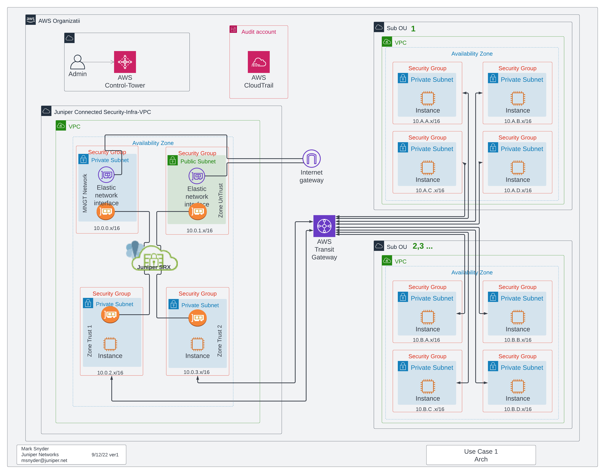

##### Expected architectural design principles
> ###### Security Infrastructure VPC
  >>To provide a security VPC infrastructure were all other AWS account's Organizational units traverse through a specified security VPC. The security infrastructure VPC acts as a head-end egress and ingress point for all traffic coming into AWS.  Traffic is forced through the SRX firewall.  All traditional firewall features can be used to inspect, secure and enforce traffic.  This includes typical, traffic filtering rules, IPS, URL-filtering, traffic inspection, in addition to advance features such as Juniper's encrypted traffic analysis, threat intelligence and protection services.
  >>> ##### Security Infrastructure VPC - Network segments
  >>>> Four Network Segments are created. Public Internet Segment is used for all Public egress and ingress traffic. Management for Juniper SRX management, and two private segments, east and west.  The public subnet is directly publicly facing and should be considered an insecure segment. The default configuration, is to allow all established session out. This may need to be adjusted on organizational designs. The management subnets, AWS security groups default is to allow any ssh public access. Which can be edited at time of initial deployment.  East and west subnets are for Transit Gateway connectivity, and for future other expansion considerations. Expansions can include, zone segmentation (levels of security) or for third party and appliance integrations
  >>> ##### Scaling, and High Availability
  >>>> Auto-Scaling
  >>>>> The SRX can be scaled horizontally for larger workload and traffic flows. Scaling is achieved by utilizing AWS Auto-Scaling groups. For integration of Auto-scaling, this requires manual setup and configuration outside of the deployment steps here.

  >>>> High Availability
  >>>>> High Availability can be achieved by using AWS application load balancers. For integration of Auto-scaling, this requires manual setup and configuration outside of the deployment steps here.

  > ##### Organization units
  >> ###### Organizational structure - Parent and Child
  >>  All Organizational units that are to be included as part off the security VPC, are to be created as a child organization under the parent (security infrastructure VPC). Metatags are in place that will allow future, multi security infrastructure to allow for separations of security domains and traffic. Additionally to allow, deployment checks of what security domain that child OU should follow

>> ##### Account creations
>>>  During new account creation, all accounts will have default VPC networking, Internet gateways, subnets and security groups deleted and removed, replaced with new architect  elements helping to ensure traffic is sent through the security infrastructure VPC.

> ##### Traffic flow - routing
>>All child organizational unit's routing and traffic flows are handled through Transit Gateway associations and subneting and subnet associations at the time of automated creation. The Parent Security VPC is included with the exception of default gateway segment that is explicitly created.

> ##### Network Addressing - IP CIDR
>> Security Infrastructure VPC
>>> All traffic is passed through this Parent VPC. Since traffic only traverses, with this design all addresses for the parent VPC are static addresses and are assigned during deployment. Future revisions may allow customization.
>> Child Organizational units
>>> All child organizational units have a VPC CIDR block created and assigned at time of account creation. The account is assigned a major CIDR range with a 16 bit mask. The first 8 bit mask is static, with the remaining bits incremented for each account creation. For example account A 10.a.x.x and account B 10.b.xx. Each VPC is further segmented into four 24 bit equally dived masks subnets. For example, account B would have 10.b.a'.x/24, 10.b.b'.x/24, 10.b.c'.x/24 and 10.a.d'.x/24.     Four subnets are created

>>  IPv4
>>> IPv4 only

##### Methodology and workflow
>The workflow intent is for the initial configuration for the Parent Security Infrastructure VPC to deployed once, and the child Organizational units several times where the child organizational units process are all automated.

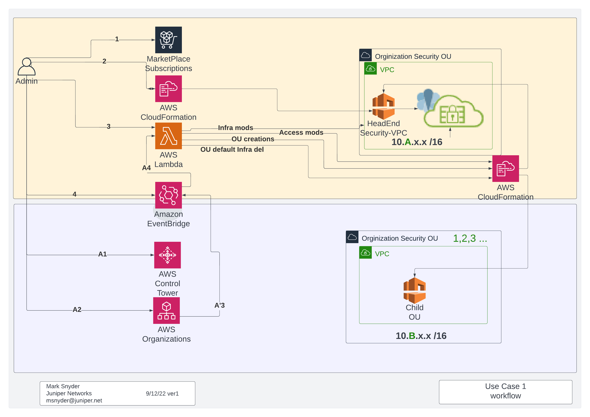

##### Deployment, Setup and Installation
>> ##### Components Used
>> Juniper Networks vSRX from the AWS Market Place, AWS Control Tower, Organizations. CloudFormation, Lambda, EventBridge, Systems Parameter Store, S3 and Resource Access Manager are used for this solution.  AWS Control Tower Account-factory or Organization can be used for creating Accounts and for Organizations.

>> ##### Market Place Subscriptions
>> An AWS Market Place subscription for the Juniper vSRX is required for this solution. Both BYOL, or PAYG will be  needed. It is recommended to use the latest vSRX version.

>> ##### Prerequisite setup and settings
>>> AWS Control Tower must have been previously deployed with the AWS IAM roles, Control Tower and CloudFormation, Execution and administration must be deployed for all Organizations manged by Control Tower.  [https://docs.aws.amazon.com/control tower/latest/user guide/deployment.html]()

>>> S3 - Simple Storage Service
>>>> An S3 bucket must be created for the storing of Cloud Formation Templates. AWS Lambda will refer to these scripts for deployment.

>>> IAM - Identity and Access Management
>>>> An administration account will be needed that is NOT the root account. This account should have execution privileges needed to deploy Control Tower, CloudFormation templates, Lambda, S3, and IAM roles

>>>> An IAM role for lambda will need to be created. The lambda role will need to have access to the S3 bucket were CloudFormation templates are stored and the ability to deploy cloud formation templates.

>>>> This solution, additionally creates an IAM role in each child Organization account. This role is created for the deletion of the default VPC and Internet Gateway and all the dependencies. This role can be deleted after the child OU is created. However, can be used for later administration uses and fine tuning.


>>> Lambda - functions
>>>> Two lambda functions need to be created. One for Organization registration, and another for account move and registration.
>>>> The Organization Lambda function, lambda_main.py, is responsible for the core infrastructure and all address management for child organizational units. This lambda function must be called by the Organization registration EventBridge. It should be noted that Organization unit can either be created with Control Tower or within Organizations and then registered in Control Tower.
>>>> The second Lambda script, ddvpc_function.py, is responsible for the deletion on the default VPC and Internet Gateway. This function is called from one of two EventBridge rules. Either when a new account is created in Account Factory, or if the accounts created in organizations and the account is moved.
>>>>> #### Extreme caution
>>>>> Extreme caution needs to be practiced for ddvpc_function.py and when it is called. Currently, there are NO checks for "if" the account being moved, is in an account that is within a child organizational unit under the Security Infrastructure VPC.  This check is planed for future releases. There are currently no tags in organizations to check and needs coding to determine, parent Organization, child Organizational Unit, and "managed" account relationships...

>>>Lambda functions must ensure all timeouts are at least 15 minutes or scripts "may" fail to complete.

>>> EventBridge
>>>> Three EventBridge rules need to be created. Each rule triggers lambda functions specific to organizational unit registration in Control Tower, AWS Account creation within Account Factory, or an account that was created within Organizations, and moved into a child Organizational Unit.  It should be noted, that technically this account is not "really" managed by Control Tower.

>>>>  EventBridge Organizational Unit Registration trigger
```
{
  "source": ["aws.controltower"],
  "detail-type": ["AWS Service Event via CloudTrail"],
  "detail": {
    "eventName": ["RegisterOrganizationalUnit"]
  }
}
```
>>>> EventBridge Organization account created and moved trigger
```
{
  "source": ["aws.organizations"],
  "detail-type": ["AWS API Call via CloudTrail"],
  "detail": {
    "eventSource": ["organizations.amazonaws.com"],
    "eventName": ["MoveAccount"]
  }
}
```
>>>> EventBridge Account Factory / Control Tower account creation trigger
```
{
  "source": ["aws.controltower"],
  "detail-type": ["AWS Service Event via CloudTrail"],
  "detail": {
    "eventName": ["CreateManagedAccount"]
  }
}
```

>>> SSH Key-pair
>>>> Create an SSH key-pair to be used for remote administration of the vSRX after deployment. Creating user key-pairs, or using AWS hardware key management is supported by the vSRX, and can be used my modifying vSRX resource section of hsst1.json CloudFormation template.

>>> Organization Unit for the Security Infrastructure
>>>> An Organization unit will need to be created as the Security Infrastructure that is a child of the root account of "your" organization/company/identity. The identity of the Organization Unit should have an ID that begins with "OU-" and NOT "r-" or "o".  This new organization will have all traffic from child Organizational Units "ou-" flow through this new OU. Make note of the OU ID created. For example ou-ad12-a1b2b3b4.

>>> Owner account for Security Infrastructure OU
>>>> The owner account with be a new AWS account used specifically as the owner for all related account functions for the OU. Make note of the 12 digit ID of the account created.  This will be used as part of the deployment.

>>> Control Tower - Service Control polices
>>>> WIP

>>> Control Tower - Guard Rails
>>>> WIP

##### General Deployment
>> After all prerequisites are completed. Initial Security Infrastructure VPC can be deployed. The security VPC is created by deploying two CloudFormation templates. HSST1 and HSST2. Head-end Stackset Security Template 1 and 2.

>> ###### hsst1  Head-end Security Infrastructure VPC

>> Ensure that the account that is being used for the next steps are being performed from a top organization account and is "NOT" the root account. Additionally this step "IS" performed at the root organization AND NOT at Security Infrastructure OU created from the prerequisites.

>>Using AWS CloudFormation, ensure that Stacksets is selected and select "create StackSet" create a new Create Stactset. Leave the default setting and use the hsst1.json template. Fill the fields similar to the fields here, changing you IP address for remote SSH management, the 12 digit account and the name of your key-pair created in the prerequisites.

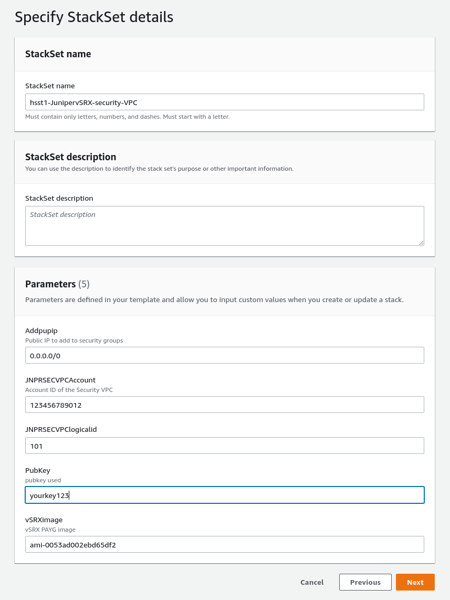

>> Select next until you get to the following screen. Make sure to change "Deploy to organization units(OUs)" with the OU ID created earlier. Additionally, specify the region to US East (N.Virginia)

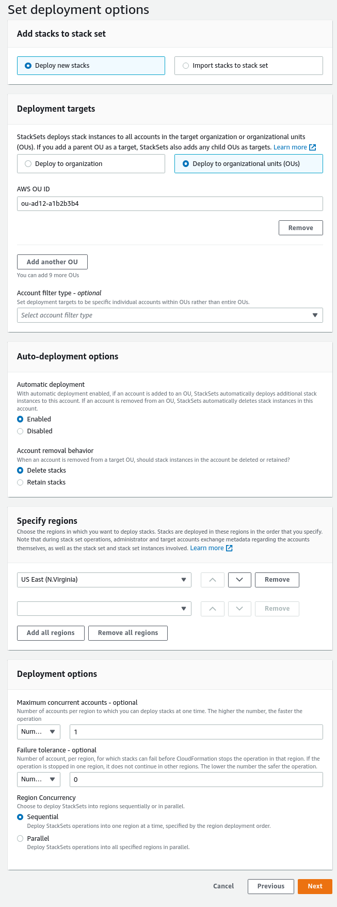

>> Click Submit
>> Wait at least 3 minutes until the stackset Operations shows a Status as SUCCEEDED as shown here.

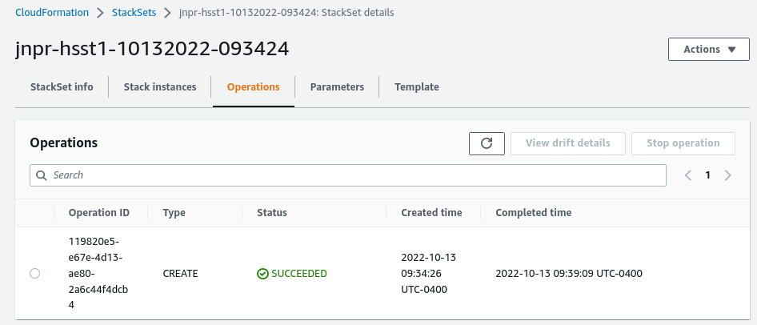


>> ###### hsst2  Head-end Security Infrastructure VPC
>> For hsst2, leave the default parameters section as is.  These are Parameters are being pulled from System Manager Parameters and were generated from the previous step. Select next until you get to the deployment targets page.  AS in the previous step, ensure to change "Deploy to organization units(OUs)" with the OU ID created earlier. Additionally, specify the region to US East (N.Virginia). click next until submit and enter submit.

>> Check the status of the StackSet to ensure it was successful.

>> ###### vSRX instance
>> Prior to traffic getting routed through the vSRX. The vSRX will need to be rebooted. Please stop and restart the vSRX prior to the next steps.

>> ###### General Use - Use the solution
>> With the setup portion and deployment complete.  New child Organizational Units, when created will have all traffic routed back through the Security Infrastructure VPC. All AWS Security Control Policies that were created and Guard Rails as applied to the child Organizations.

>>Ensure that the account that is being used for the next steps are being performed from a top organization account and is "NOT" the root account. Additionally this step "IS" performed at the root organization AND NOT at Security Infrastructure OU created from the prerequisites.

>>> ###### Creating new child Organizational Units
>>>> From either Organizations or from Control Tower, create a new Child Organization. In the example underneath, the Security Infrastructure VPC, is the organization "FORG" and any child organizational unit, are children who's traffic will flow through the Security VPC. The child OUs are sub1,sub2 and sub3 as examples.
>>>> ###### Using Control Tower to create the child OU
>>>> For creating child Organizational units using Control Tower

>>>> Create a new organization, from the Create resources "Create organization unit".

>>>>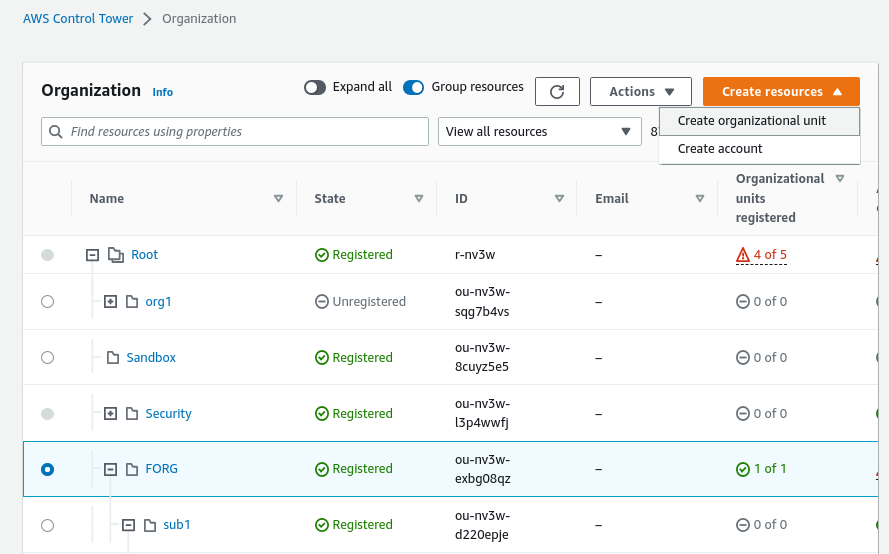

>>>> In the add an OU screen add the name of teh new child OU and ensure that the Parent OU is the Security infrastructure OU.

>>>>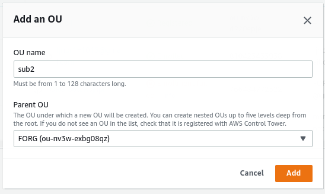

>>>> In the screen capture underneath, the organizational unit is being created.

>>>>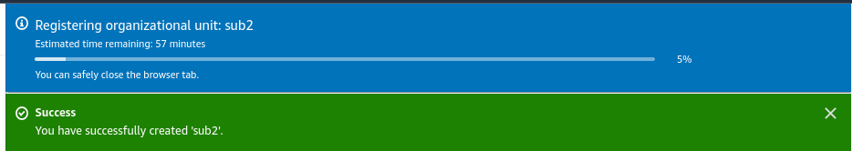

>>>> Once completed, you will find the completed registered sub2 child OU.

>>>>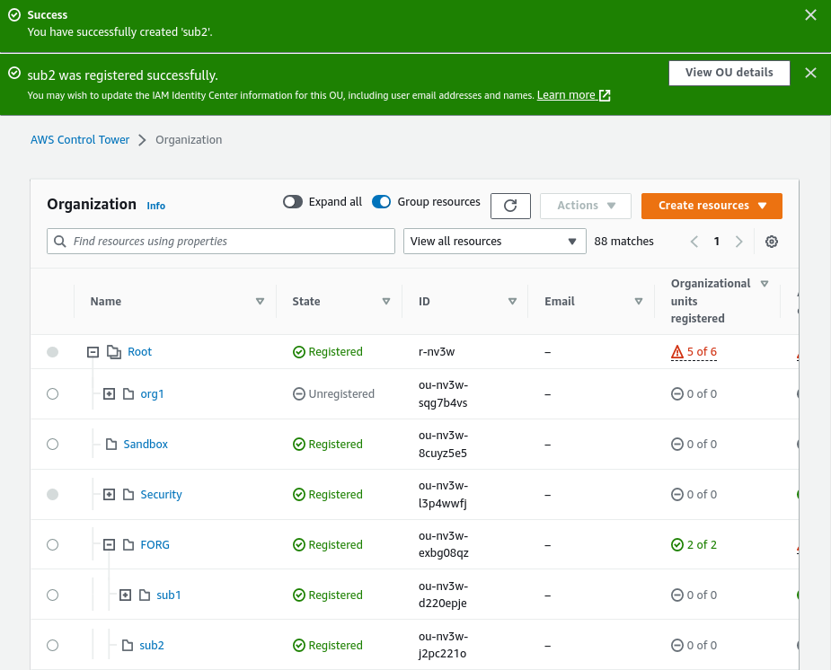

>>>> ###### Ussing Organizations to create the child OU
>>>> For creating child Organizational units using organization

>>>> Check the box next to the Parent OU of the Security Infrastructure OU. and from the Action menu > under Organization unit, select Creet new.
>>>>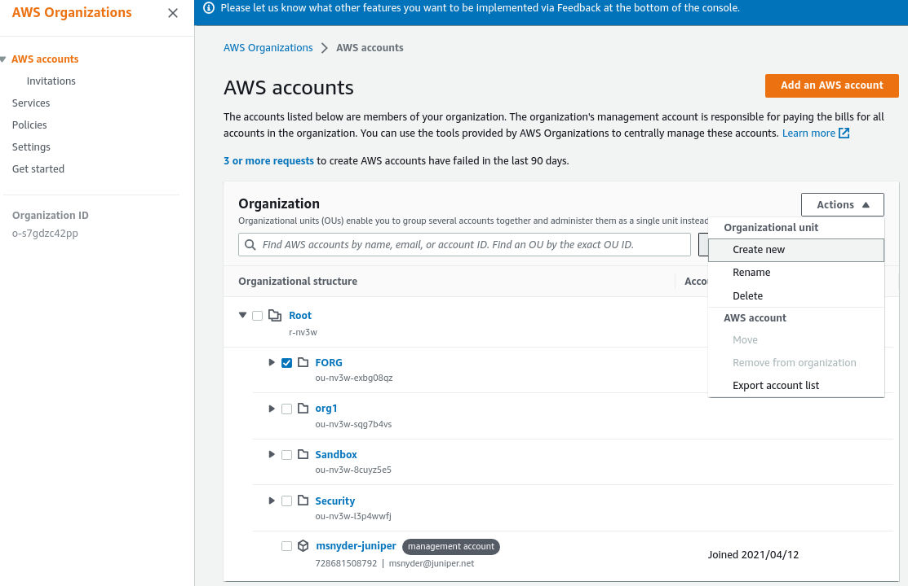

>>>> Enter the new child Organizational unit, and select Create organizational unit.

>>>>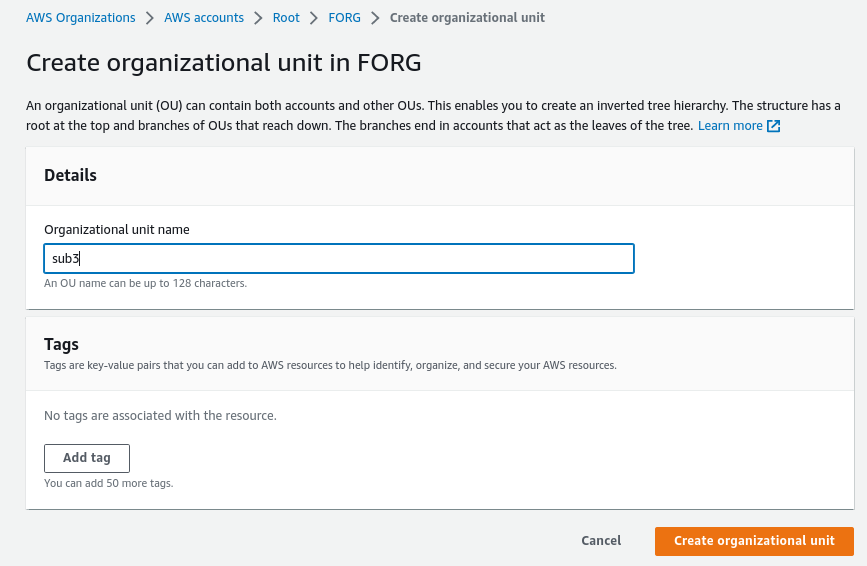

>>>> Now that the OU is created it needs to be registered in Control Tower.
>>>> from the Control Tower screen, select the OU , just created. from the action menu, select register OU. You will need to accept the terms and conditions.

>>>>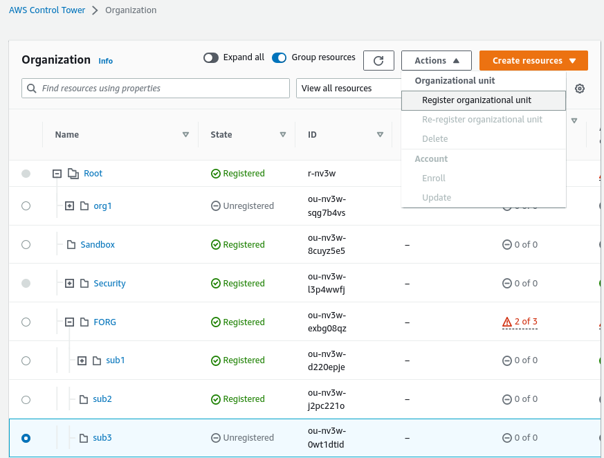

>>>> From both methods above, the child organizational unit is registered with Control Tower.
>>>>

>>> ###### Creating new accounts for the new child Organizational Units
>>>> WIP


##### Current and known issues
>> [./KNOWN.md]()

##### Release information

>>All code, templates and other files in this repository are released on an “AS IS” BASIS, WITHOUT WARRANTIES, CONDITIONS, OR SUPPORT OBLIGATIONS OF ANY KIND, EXPRESS OR IMPLIED.

##### Related and Supporting links
>> [https://www.juniper.net/us/en/solutions/next-gen-firewall.html]()
>>[https://www.juniper.net/documentation/us/en/software/vsrx/vsrx-consolidated-deployment-guide/vsrx-aws/topics/concept/security-vsrx-aws-overview.html]()

>> YouTube video - WIP

#### Author
>> Mark Snyder
>> Juniper Networks
>> msnyder@juniper.net
>> [https://linkedin.com/in/m-msnyder]()
